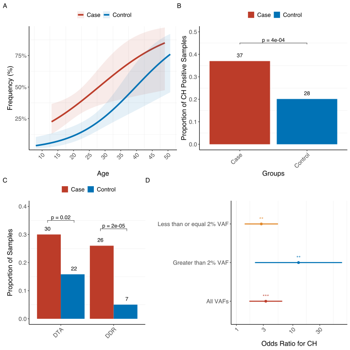

CH in Survivors of Childhood Cancer
================
Irenaeus Chan
Fri May 05, 2023 15:19:16

-   [Table 1](#table-1)
-   [Figure 1](#figure-1)
-   [Supp Figure 1](#supp-figure-1)
-   [Supp Figure 2](#supp-figure-2)
-   [Supp Figure 3A](#supp-figure-3a)
-   [Supp Figure 3B](#supp-figure-3b)
-   [Supp Figure 4](#supp-figure-4)
-   [Supp Figure Donut](#supp-figure-donut)

``` r
knitr::opts_chunk$set(dev = "svg")

library(dplyr)
library(table1)
library(ggpubr)
library(ggthemr)
library(logistf)
library(ggsci)
library(patchwork)
library(sjPlot)
library(purrr)

panel_theme_basic = theme_bw() + theme(
  panel.border = element_blank(),
  legend.title = element_blank(),
  legend.key.size = unit(5, 'mm'),
  legend.position = 'top',
  legend.direction = 'horizontal',
  legend.text = element_text(size = 12),
  plot.subtitle = element_text(hjust = 0.5, size = 8),
  plot.title = element_text(face = 'bold', hjust = 0, vjust = -2, size = 18),
  panel.grid.major = element_blank(),
  strip.background = element_blank(),
  strip.text = element_text(size = 12),
  axis.text.y = element_text(size = 12),
  axis.text.x = element_text(angle = 45, hjust = 1, size = 12),
  axis.title = element_text(size = 14),
  axis.line = element_line(colour = "black"),
  plot.margin = unit(c(0,0,0,0), 'pt')
)

panel_theme_donut = theme(
  legend.direction = 'vertical',
  legend.position="top", 
  legend.text = element_text(size=12),
  plot.margin = margin(t = 0, r = 0, b = 0, l = 0),
  axis.text = element_text(size = 14)
)

substitution_types = c(
  "G>T" = "C>A", "G>C" = "C>G", "G>A" = "C>T",
  "A>T" = "T>A", "A>G" = "T>C", "A>C" = "T>G",
  "C>A" = "C>A", "C>G" = "C>G", "C>T" = "C>T",
  "T>A" = "T>A", "T>C" = "T>C", "T>G" = "T>G")

signif.num <- function(x, ns = FALSE) {
  if (ns) {
    symbols = c("***", "**", "*", "ns")
  } else {
    symbols = c("***", "**", "*", "")
  }
  
  symnum(unlist(x), corr = FALSE, na = FALSE, legend = T,
         cutpoints = c(0, 0.001, 0.01, 0.05, 1), 
         symbols = symbols)
}
```

``` r
D <- read.csv("D_long.csv", header = T, comment = "")
M <- read.csv("D_wide.csv", header = T, comment = "")

D <- D %>% 
  mutate(
    VAF_BIN = case_when(
      average_AF > 0.10 ~ ">10%",
      average_AF <= 0.10 & average_AF > 0.02 ~ "2-10%",
      average_AF <= 0.02 & average_AF >= 0.001 ~ "0.1-2%",
      TRUE ~ "0%"
    ),
    Gene_Class = case_when(
      Gene == "DNMT3A" | Gene == "TET2" | Gene == "ASXL1" ~ "DTA",
      Gene == "PPM1D" | Gene == "TP53" | Gene == "CHEK2" ~ "DDR",
      Gene == "SRSF2" | Gene == "SF3B1" ~ "Splice",
      Gene == "JAK2" ~ "JAK2",
      Gene == "No Mutation" ~ "No Mutation"
    ),
    DTA = if_else(Gene_Class == "DDR", 1, 0),
    DDR = if_else(Gene_Class == "DTA", 1, 0),
    Origin = case_when(
      Cohort == "Normal Control" ~ "Solid Tumor Control",
      Cohort == "WashU Control" ~ "Healthy Control",
      Cohort == "Case" ~ "Case"
    ),
    Cohort = case_when(
      Cohort == "Astronaut" ~ "Control",
      Cohort == "Case" ~ "Case",
      Cohort == "Normal Control" ~ "Control",
      Cohort == "WashU Control" ~ "Control"
    )
  )

M <- M %>%
  mutate(
    CH_Binary = if_else(CH.Positive == "Yes", 1, 0),
    Origin = case_when(
      Cohort == "Normal Control" ~ "Solid Tumor Control",
      Cohort == "WashU Control" ~ "Healthy Control",
      Cohort == "Case" ~ "Case"
    ),
    Cohort = case_when(
      Cohort == "Astronaut" ~ "Control",
      Cohort == "Case" ~ "Case",
      Cohort == "Normal Control" ~ "Control",
      Cohort == "WashU Control" ~ "Control"
    ),
    TxBIN = case_when(
      YearsSinceTreatment <= 5 ~ "<=5 Years After Treatment",
      YearsSinceTreatment > 5 ~ ">5 Years After Treatment",
      TRUE ~ "Untreated"
    )
  )
```

``` r
# Removing Duplicate Sample and ALL Patients with Secondary Solid Cancer
M <- M %>%
  filter(
    !SampleID %in% c("LBC_018", "LBC_041", "LBC_116")
  )

# Removing Patient that relapsed 6x over 20+ Years
M <- M %>% 
  filter(
    !SampleID %in% c("LBC_093")
  )

# Removing SMN - If needed
# M %>%
#   filter(
#     !SampleID %in% c("LBC_005", "LBC_077", "LBC_053", "LBC_063", "LBC_098", "LBC_101")
#   )
```

``` r
fig1b_model <- M %>%
  mutate(
    Cohort = relevel(
      factor(Cohort),
      ref = "Control"
    )
  ) %>%
  glm(
    formula = CH_Binary ~ Cohort + Age + Gender + Race,
    family = "binomial"
  ) %>%
  get_model_data(
    type = "est"
  )

fig1c_model <- bind_rows(
  M %>%
    logistf(
      formula = DTA_CH ~ Cohort + Age + Gender + Race,
      family = "binomial"
    ) %>%
    get_model_data(
      type = "est"
    ) %>% 
    filter(term == "CohortControl"),
  M %>% logistf(
    formula = DDR_CH ~ Cohort + Age + Gender + Race,
    family = "binomial"
    ) %>%
    get_model_data(
      type = "est"
    ) %>% 
    filter(term == "CohortControl")
  )

fig1d_model <- bind_rows(
  M %>%
    mutate(
      Cohort = relevel(factor(Cohort), ref = "Control")
    ) %>%
    logistf(
      formula = CH_Binary ~ Cohort + Age + Gender + Race,
      family = "binomial"
    ) %>% 
    get_model_data(
      type = "est"
    ) %>%
    cbind(
      VAF = "All VAFs"
    ) %>%
    filter(term == "CohortCase"),
  M %>%
    mutate(
      Cohort = relevel(factor(Cohort), ref = "Control")
    ) %>%
    filter(VAF_group == ">2%" | VAF_group == "No CH") %>%
    logistf(
      formula = CH_Binary ~ Cohort + Age + Gender + Race,
      family = "binomial"
    ) %>%
    get_model_data(
      type = "est"
    ) %>%
    cbind(
      VAF = "Greater than 2% VAF"
    ) %>%
    filter(term == "CohortCase"),
  M %>%
    mutate(
      Cohort = relevel(factor(Cohort), ref = "Control")
    ) %>%
    filter(VAF_group == "<=2%" | VAF_group == "No CH") %>%
    logistf(
      formula = CH_Binary ~ Cohort + Age + Gender + Race,
      family = "binomial"
    ) %>%
    get_model_data(
      type = "est"
    ) %>%
    cbind(
      VAF = "Less than or equal 2% VAF"
    ) %>%
    filter(term == "CohortCase")
)

suppfig1_model <- bind_rows(
  M %>%
    mutate(
      Origin = relevel(factor(Origin), ref = "Healthy Control")
    ) %>%
    filter(
      Origin != "Solid Tumor Control"
    ) %>%
    glm(
      formula = CH_Binary ~ Origin + Age + Gender + Race,
      family = "binomial"
    ) %>%
    get_model_data(
      type = "est"
    ),
  M %>%
    mutate(
      Origin = relevel(factor(Origin), ref = "Healthy Control")
    ) %>%
    filter(
      Origin != "Healthy Control"
    ) %>%
    glm(
      formula = CH_Binary ~ Origin + Age + Gender + Race,
      family = "binomial"
    ) %>%
    get_model_data(
      type = "est"
    ),
  M %>%
    mutate(
      Origin = relevel(factor(Origin), ref = "Healthy Control")
    ) %>%
    filter(
      Origin != "Case"
    ) %>%
    glm(
      formula = CH_Binary ~ Origin + Age + Gender + Race,
      family = "binomial"
    ) %>%
    get_model_data(
      type = "est"
    )
)

genes <- D %>%
  mutate(
    Gene = as.factor(Gene)
  ) %>%
  pull(Gene) %>%
  unique()
suppfig3_model <- bind_rows(
  map(genes, function(gene) {
    Samples <- D %>%
      filter(Gene == gene) %>%
      pull(SampleID)
    M %>%
      mutate(
        CH_Gene = if_else(
          SampleID %in% Samples,
          1,
          0
        )
      ) %>%
      logistf(
        formula = CH_Gene ~ Cohort + Age + Gender + Race,
        family = "binomial"
      ) %>%
      get_model_data(
        type = "est"
      ) %>%
      mutate(
        Gene = gene
      ) %>%
      filter(
        term == "CohortControl"
      )
  })
)
```

# Table 1

``` r
table1(~ Age + Gender + Race + CH.Positive | Cohort, data = M)
```

    ##                                     Case           Control           Overall
    ## 1                                (N=100)           (N=139)           (N=239)
    ## 2                  Age                                                      
    ## 3            Mean (SD)       21.4 (7.15)       24.8 (8.14)       23.3 (7.91)
    ## 4    Median [Min, Max] 19.0 [13.0, 49.0] 23.1 [8.00, 50.7] 21.6 [8.00, 50.7]
    ## 5               Gender                                                      
    ## 6                    F        50 (50.0%)        81 (58.3%)       131 (54.8%)
    ## 7                    M        50 (50.0%)        58 (41.7%)       108 (45.2%)
    ## 8                 Race                                                      
    ## 9     African American          6 (6.0%)        21 (15.1%)        27 (11.3%)
    ## 10               Asian          8 (8.0%)         12 (8.6%)         20 (8.4%)
    ## 11               Other          1 (1.0%)          7 (5.0%)          8 (3.3%)
    ## 12              Unkown          1 (1.0%)         10 (7.2%)         11 (4.6%)
    ## 13               White        84 (84.0%)        89 (64.0%)       173 (72.4%)
    ## 14         CH.Positive                                                      
    ## 15                  No        63 (63.0%)       111 (79.9%)       174 (72.8%)
    ## 16                 Yes        37 (37.0%)        28 (20.1%)        65 (27.2%)

# Figure 1

``` r
fig1a <- M %>%
  ggplot(
    aes(x = Age,
        y = CH_Binary,
        color = Cohort
    )
  ) +
  geom_smooth(
    aes(fill = Cohort,
        color = Cohort
    ),
    method = "gam",
    formula = y ~ s(x),
    method.args = list(family = "binomial"),
    size = 1.5,
    se = TRUE,
    alpha = 0.1
  ) +
  scale_y_continuous(
    labels = scales::label_percent(accuracy = 1L),
    expand = expansion(add = c(0.01, 0.01))
  ) +
  scale_x_continuous(
    breaks = seq(0, 50, by = 5)
  ) + 
  labs(x = "Age",
       y = "Frequency (%)"
  ) +
  panel_theme_basic +
  scale_fill_nejm() + scale_color_nejm()
```

    ## Warning: Using `size` aesthetic for lines was deprecated in ggplot2 3.4.0.
    ## ℹ Please use `linewidth` instead.

``` r
fig1a
```

<!-- -->

``` r
fig1b <- D %>%
  distinct(Cohort, SampleID) %>%
  group_by(Cohort) %>%
  summarise(Total = n()) %>%
  left_join(
    D %>%
      filter(ch_pd_kb == 1) %>%
      distinct(Cohort, SampleID) %>%
      group_by(Cohort) %>%
      summarise(Total_CH = n()),
    by = "Cohort"
  ) %>%
  mutate(Proportion = Total_CH/Total) %>%
  ggplot(
    aes(x = Cohort,
        y = Proportion,
        fill = Cohort
    )
  ) +
  geom_bar(
    stat = "identity",
    position = position_dodge(preserve = "single")
  ) +
  geom_signif(
    y_position = 0.45,
    xmin = 1,
    xmax = 2,
    annotation = paste0("p = ", format(fig1b_model$p.value[1], digits = 1)),
    tip_length = 0.03,
    size = 0.3
  ) +
  geom_text(
    aes(label = Total_CH),
    vjust = -1
  ) +
  labs(x = "Groups",
       y = "Proportion of CH Positive Samples"
  ) +
  ylim(0, 0.5) +
  panel_theme_basic +
  scale_fill_nejm() + scale_color_nejm()
fig1b
```

<!-- -->

``` r
fig1c <- D %>%
  filter(Gene != "No Mutation") %>%
  distinct(Gene_Class, SampleID, Gene, Cohort) %>%
  group_by(Gene_Class, Cohort) %>%
  summarise(Samples = sum(n())) %>%
  left_join(
    D %>%
      distinct(Cohort, SampleID) %>%
      group_by(Cohort) %>%
      summarise(Total = n()),
    by = "Cohort"
  ) %>%
  mutate(
    Proportion = Samples/Total
  ) %>%
  filter(
    Gene_Class != "JAK2"
  ) %>%
  ggplot(
    aes(x = reorder(Gene_Class, -Proportion),
        y = Proportion,
        fill = Cohort
    )
  ) +
  geom_bar(
    stat = "identity",
    position = position_dodge(preserve = "single")
  ) +
  geom_signif(
    y_position = 0.35,
    xmin = 0.75,
    xmax = 1.25,
    annotation = paste0("p = ", format(fig1c_model$p.value[1], digits = 1)),
    tip_length = 0.03,
    size = 0.3
  ) + 
  geom_signif(
    y_position = 0.32,
    xmin = 1.75,
    xmax = 2.25,
    annotation = paste0("p = ", format(fig1c_model$p.value[2], digits = 1)),
    tip_length = 0.03,
    size = 0.3
  ) + 
  geom_text(
    aes(label = Samples,
        vjust = -1
    ),
    position = position_dodge(width = 1)
  ) +
  labs(x = "",
       y = "Proportion of Samples"
  ) + 
  ylim(0, 0.4) +
  panel_theme_basic +
  scale_fill_nejm() + scale_color_nejm()
```

    ## `summarise()` has grouped output by 'Gene_Class'. You can override using the
    ## `.groups` argument.

``` r
fig1c
```

<!-- -->

``` r
fig1d <- fig1d_model %>%
  mutate(
    term = factor("Treated Individuals"),
    p_fdr = p.adjust(p.value, method = "fdr")
  ) %>%
  arrange(estimate, VAF) %>%
  mutate(
    q.value = p.adjust(p.value, n = nrow(.), method = 'fdr'),
    q.label = paste0(signif(estimate, 2), signif.num(q.value)),
    q.star = signif.num(q.value)
  ) %>%
  ggplot(
    aes(x = VAF,
        y = estimate,
        ymin = conf.low,
        ymax = conf.high,
        color = VAF
    )
  ) +
  geom_point(
    position = position_dodge(width = 0.8),
    size = 2
  ) +
  geom_errorbar(
    position = position_dodge(width = 0.8),
    width = 0,
    size = 1
  ) +
  geom_text(
    aes(label = q.star,
        vjust = -0.7
    ),
    position = position_dodge(width = 0.8),
    size = 4,
    alpha = 0.9
  ) +
  geom_hline(
    yintercept = 1,
    color = "black",
    linetype = "solid", 
    alpha = 0.1
  ) + 
  coord_flip() +
  labs(x = "",
       y = "Odds Ratio for CH"
  ) +
  scale_y_log10() +
  panel_theme_basic +
  theme(
    legend.text = element_blank(),
    legend.position = "none"
  ) +
  scale_fill_nejm() + scale_color_nejm()
fig1d
```

    ## Don't know how to automatically pick scale for object of type <noquote>.
    ## Defaulting to continuous.

<!-- -->

``` r
Fig1 <- (fig1a + fig1b) / (fig1c + fig1d) + plot_annotation(tag_levels = 'A')
Fig1
```

    ## Don't know how to automatically pick scale for object of type <noquote>.
    ## Defaulting to continuous.

<!-- -->

# Supp Figure 1

``` r
D %>%
  filter(ch_pd_kb == 1) %>%
  group_by(Origin) %>%
  summarise(Frequency = n_distinct(SampleID)) %>%
  left_join(
    M %>%
      group_by(Origin) %>%
      summarise(Total = n()),
    by = "Origin"
  ) %>%
  mutate(
    Proportion = Frequency/Total
  ) %>%
  ggplot(
    aes(x = Origin,
        y = Proportion,
        fill = Origin
    )
  ) + 
  geom_bar(
    stat = "identity",
    position = position_dodge(preserve = "single")
  ) +
  geom_signif(
    y_position = 0.42,
    xmin = 1,
    xmax = 2, 
    annotation = paste0("p = ", 
                        format(suppfig1_model$p.value[1], digits = 1),
                        suppfig1_model$p.stars[1]
                        ),
    tip_length = 0.03,
    size = 0.3
  ) +
  geom_signif(
    y_position = 0.45,
    xmin = 1,
    xmax = 3, 
    annotation = paste0("p = ", 
                        format(suppfig1_model$p.value[2], digits = 1),
                        suppfig1_model$p.stars[2]
                        ),
    tip_length = 0.03,
    size = 0.3
  ) +
  geom_signif(
    y_position = 0.32,
    xmin = 2,
    xmax = 3, 
    annotation = paste0("p = ", 
                        format(suppfig1_model$p.value[3], digits = 1),
                        suppfig1_model$p.stars[3]
                        ),
    tip_length = 0.03,
    size = 0.3
  ) +
  geom_text(
    aes(label = Frequency,
        vjust = -1
    )
  ) +
  ylim(0, 0.5) +
  labs(x = "",
       y = "Proportion of CH Positive Samples"
  ) +
  panel_theme_basic +
  scale_fill_nejm() + scale_color_nejm() 
```

<!-- -->

# Supp Figure 2

``` r
D %>% 
  filter(
    ch_pd_kb == 1,
    Gene_Class != "JAK2"
  ) %>%
  ggplot(
    aes(x = Gene_Class,
        y = average_AF,
        fill = Cohort
    )
  ) + 
  geom_boxplot(
    position = position_dodge(0.9)
  ) +
  geom_violin(
    position = position_dodge(0.9),
    alpha = 0.5
  ) +
  scale_y_continuous(
    trans = "log",
    labels = scales::number_format(accurcy = 0.001)
  ) +
  labs(x = "",
       y = "VAF"
  ) + 
  panel_theme_basic +
  scale_fill_nejm() + scale_color_nejm()
```

<!-- -->

# Supp Figure 3A

``` r
M %>%
  left_join(
    D %>%
      filter(ch_pd_kb == 1) %>%
      group_by(SampleID, Cohort) %>%
      summarise(MutationsPerSample = n()),
    by = c("SampleID", "Cohort")
  ) %>%
  mutate(
    TotalMutations = case_when(
      is.na(MutationsPerSample) ~ "0",
      MutationsPerSample == 1 ~ "1",
      MutationsPerSample == 2 ~ "2",
      MutationsPerSample == 3 ~ "3",
      MutationsPerSample == 4 ~ "4",
      MutationsPerSample == 5 ~ "5",
      MutationsPerSample == 6 ~ "6",
      MutationsPerSample == 7 ~ "7",
      MutationsPerSample == 8 ~ "9",
      TRUE ~ "9+"
    )
  ) %>% 
  group_by(TotalMutations, Cohort) %>%
  summarise(Frequency = n()) %>%
  filter(TotalMutations != "0") %>%
  ggplot(
    aes(x = TotalMutations,
        y = Frequency,
        fill = Cohort
    )
  ) +
  geom_bar(
    stat = "identity",
    position = position_dodge(preserve = "single")
  ) +
  labs(x = "Number of Samples",
       y = "Total # of Mutations"
  ) +
  panel_theme_basic +
  scale_fill_nejm() + scale_color_nejm()
```

    ## `summarise()` has grouped output by 'SampleID'. You can override using the
    ## `.groups` argument.
    ## `summarise()` has grouped output by 'TotalMutations'. You can override using
    ## the `.groups` argument.

<!-- -->

# Supp Figure 3B

``` r
D %>%
  distinct(Gene, SampleID, Cohort) %>%
  group_by(Gene, Cohort) %>%
  summarise(Samples = sum(n())) %>%
  left_join(
    D %>%
      distinct(Cohort, SampleID) %>%
      group_by(Cohort) %>%
      summarise(Total = n()),
    by = "Cohort"
  ) %>%
  mutate(Proportion = Samples/Total) %>%
  filter(Gene != "No Mutation") %>%
  ggplot(
    aes(x = reorder(Gene, -Proportion),
        y = Proportion,
        fill = Cohort
    )
  ) +
  geom_bar(
    stat = "identity",
    position = position_dodge(preserve = "single")
  ) +
  geom_signif(
    y_position = 0.17,
    xmin = 2.8,
    xmax = 3.2,
    annotation = paste0("p = ", 
                        format(suppfig3_model$p.value[1], digits = 1), 
                        suppfig1_model$p.stars[1]
                 ),
    tip_length = 0.03,
    size = 0.03
  ) +
  geom_signif(
    y_position = 0.15,
    xmin = 1.8,
    xmax = 2.2,
    annotation = paste0("p = ", 
                        format(suppfig3_model$p.value[2], digits = 1), 
                        suppfig1_model$p.stars[2]
                 ),
    tip_length = 0.03,
    size = 0.03
  ) + 
  geom_signif(
    y_position = 0.11,
    xmin = 3.8,
    xmax = 4.2,
    annotation = paste0("p = ", 
                        format(suppfig3_model$p.value[5], digits = 1), 
                        suppfig1_model$p.stars[5]
                 ),
    tip_length = 0.03,
    size = 0.03,
  ) +
  labs(x = "",
       y = "Proportion of Samples"
  ) +
  panel_theme_basic +
  scale_fill_nejm() + scale_color_nejm()
```

    ## `summarise()` has grouped output by 'Gene'. You can override using the
    ## `.groups` argument.

<!-- -->

# Supp Figure 4

``` r
M %>%
  mutate(
    TxBIN = relevel(factor(TxBIN), ref = "Untreated")
  ) %>%
  filter(TxBIN == ">5 Years After Treatment" | TxBIN == "Untreated") %>%
  glm(
    data = .,
    CH_Binary ~ TxBIN + Age + Gender + Race,
    family = "binomial"
  ) %>%
  get_model_data(
    type = "est"
  )
```

    ##                            term  estimate std.error conf.level   conf.low
    ## 1 TxBIN>5 Years After Treatment 2.8922647 0.3810235       0.95 1.38222433
    ## 2                           Age 1.1035989 0.0229400       0.95 1.05718744
    ## 3                       GenderM 1.0839318 0.3555246       0.95 0.53653302
    ## 4                     RaceAsian 1.0576396 0.8933521       0.95 0.16823655
    ## 5                     RaceOther 0.8897184 1.2328923       0.95 0.04022145
    ## 6                    RaceUnkown 0.3168166 1.2518809       0.95 0.01389173
    ## 7                     RaceWhite 1.5055224 0.6264152       0.95 0.47599554
    ##   conf.high   statistic df.error      p.value p.stars  p.label group xpos  xmin
    ## 1  6.198793  2.78733416      Inf 0.0053143647      **  2.89 **   pos    7 6.825
    ## 2  1.157368  4.29714508      Inf 0.0000173012     *** 1.10 ***   pos    6 5.825
    ## 3  2.175245  0.22669312      Inf 0.8206623769            1.08    pos    5 4.825
    ## 4  6.168909  0.06272961      Inf 0.9499818146            1.06    pos    4 3.825
    ## 5  8.008526 -0.09477739      Inf 0.9244916425            0.89    neg    3 2.825
    ## 6  2.894911 -0.91816412      Inf 0.3585329503            0.32    neg    2 1.825
    ## 7  5.858785  0.65314491      Inf 0.5136628589            1.51    pos    1 0.825
    ##    xmax
    ## 1 7.175
    ## 2 6.175
    ## 3 5.175
    ## 4 4.175
    ## 5 3.175
    ## 6 2.175
    ## 7 1.175

``` r
M %>%
  mutate(
    TxBIN = relevel(factor(TxBIN), ref = "Untreated")
  ) %>%
  filter(TxBIN == "<=5 Years After Treatment" | TxBIN == "Untreated") %>%
  glm(
    data = .,
    CH_Binary ~ TxBIN + Age + Gender + Race,
    family = "binomial"
  ) %>%
  get_model_data(
    type = "est"
  )
```

    ##                             term  estimate  std.error conf.level    conf.low
    ## 1 TxBIN<=5 Years After Treatment 5.2154961 0.51455513       0.95 1.921025152
    ## 2                            Age 1.1208420 0.02864106       0.95 1.062797858
    ## 3                        GenderM 1.2385184 0.40588392       0.95 0.555645925
    ## 4                      RaceAsian 0.4380239 0.94066550       0.95 0.053774025
    ## 5                      RaceOther 0.7228389 1.20808415       0.95 0.033518705
    ## 6                     RaceUnkown 0.1748150 1.26670056       0.95 0.007446149
    ## 7                      RaceWhite 0.7563981 0.55665844       0.95 0.259188880
    ##   conf.high  statistic df.error      p.value p.stars  p.label group xpos  xmin
    ## 1 14.661303  3.2098295      Inf 1.328137e-03      **  5.22 **   pos    7 6.825
    ## 2  1.190315  3.9830989      Inf 6.802242e-05     *** 1.12 ***   pos    6 5.825
    ## 3  2.753726  0.5270370      Inf 5.981679e-01            1.24    pos    5 4.825
    ## 4  2.489516 -0.8775509      Inf 3.801875e-01            0.44    neg    4 3.825
    ## 5  6.000693 -0.2686641      Inf 7.881882e-01            0.72    neg    3 2.825
    ## 6  1.571750 -1.3768268      Inf 1.685658e-01            0.17    neg    2 1.825
    ## 7  2.361470 -0.5015417      Inf 6.159899e-01            0.76    neg    1 0.825
    ##    xmax
    ## 1 7.175
    ## 2 6.175
    ## 3 5.175
    ## 4 4.175
    ## 5 3.175
    ## 6 2.175
    ## 7 1.175

``` r
M %>% 
  ggplot(
    aes(x = Age,
        y = CH_Binary,
        color = TxBIN
    )
  ) +
  geom_smooth(
    method = "gam",
    formula = y ~ s(x),
    method.args = list(family = "binomial"),
    size = 1.5,
    se = TRUE,
    alpha = 0.1
  ) +
  scale_y_continuous(
    labels = scales::label_percent(accuracy = 1L),
    expand = expansion(add = c(0.01, 0.01))
  ) +
  labs(x = "Age",
       y = "Frequency (%)"
  ) +
  panel_theme_basic +
  scale_fill_nejm() + scale_color_nejm()
```

<!-- -->

# Supp Figure Donut

``` r
D_ <- D %>% 
  filter(
    nchar(REF) == 1,
    nchar(ALT) == 1
  ) %>%
  mutate(
    nuc_change = paste0(REF, ">", ALT),
    sub_nuc = substitution_types[nuc_change]
  ) %>%
  group_by(Cohort) %>%
  count(sub_nuc)

d1 <- D_ %>%
  filter(Cohort == "Case") %>%
  ggdonutchart(
    x = "n",
    fill = "sub_nuc",
    color = "white",
    lab.pos = "out",
    lab.font = c(0.1, "plain", "black"),
    size = 0.5
  ) +
  labs(fill = "Nucleotide Change (SNVs)") +
  ggtitle("Cases") +
  panel_theme_donut +
  scale_fill_nejm() + scale_color_nejm() 

d2 <- D_ %>%
  filter(Cohort == "Control") %>%
  ggdonutchart(
    x = "n",
    fill = "sub_nuc",
    color = "white",
    lab.pos = "out",
    lab.font = c(0.1, "plain", "black"),
    size = 0.5
  ) +
  labs(fill = "Nucleotide Change (SNVs)") +
  ggtitle("Control") +
  panel_theme_donut +
  scale_fill_nejm() + scale_color_nejm() 

SuppFigDonut <- d1 + d2
SuppFigDonut
```

<!-- -->
